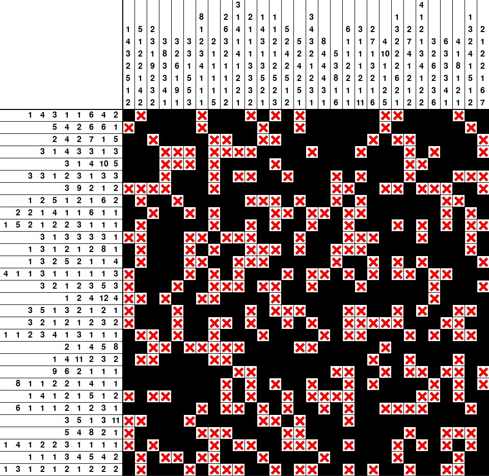

# Nonogram

The nonogram puzzle with a solver.

It requires the [pygame](https://www.pygame.org/) library to run.

Usage: `python3 main.py [-n N] [-m M] [-d DENSITY, --density DENSITY]`

Optional arguments:
 - `-n N`, the number of columns, default is 25.
 - `-m M`, the number of rows, default is 25.
 - `-d DENSITY`, `--density DENSITY`, the density of filled cells, must be between 0 and 1, default is 0.6.
